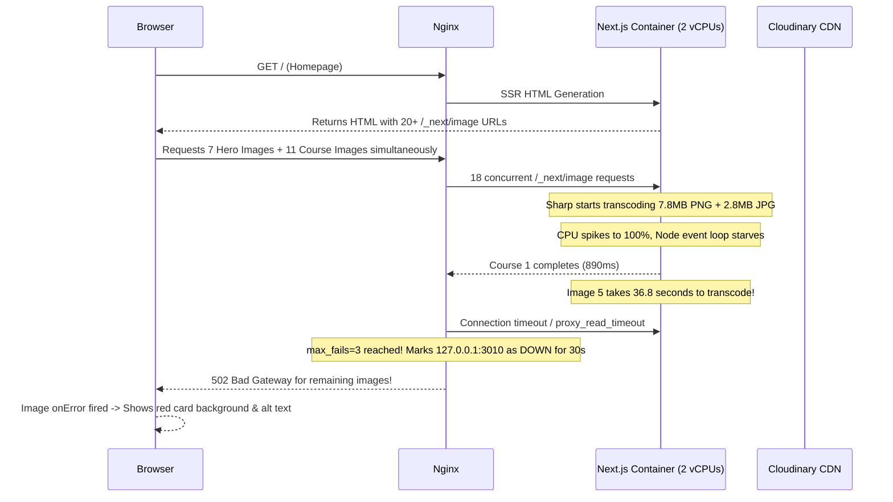

# Live Performance & Image Architecture Analysis: `progemini.academy`

**Date:** 2026-09-20  
**Target:** Live Production Website (`https://progemini.academy`)  
**Workspace:** `d:\Sikku works\proGemini\web\progemini-web` (Frontend + Backend)  
**Author:** Antigravity AI Pair Programmer  

---

## Executive Summary

1. **Why images break on the homepage course list:**
   - The homepage course cards make dynamic requests through Next.js image optimizer (`/_next/image?url=https://res.cloudinary.com/...`).
   - One of the featured course images (`MSc Global Health & Well-Being`) is a **massive 7.8 Megabyte uncompressed PNG**. Another is **2.8 Megabytes**.
   - Next.js runs `sharp` inside the Docker container (constrained to 2 vCPUs). During live benchmarking, transcoding that single 7.8 MB image took **36.85 seconds** at 100% CPU!
   - When 20+ image requests hit simultaneously on page load, Nginx reaches its connect/read timeouts.
   - In [nginx.conf](file:///d:/Sikku%20works/proGemini/web/progemini-web/nginx.conf#L8-L11), the upstream is configured with `max_fails=3 fail_timeout=30s`. Once 3 image requests time out, **Nginx marks the Next.js container dead for 30 seconds** and immediately returns `502 Bad Gateway` for all remaining images, causing them to fail and display the red fallback box with alt text.

2. **Why the website render is slow:**
   - **VPS CPU Starvation:** Next.js Server-Side Rendering (SSR) shares the exact same 2 vCPUs as `sharp` image transcoding. When images are processing, HTML generation stalls.
   - **Uncached API Round-Trips:** In [serverApi.ts](file:///d:/Sikku%20works/proGemini/web/progemini-web/progemini-frontend/src/lib/serverApi.ts#L40), all SSR requests use `cache: "no-store"`. Next.js queries the Express backend on every single page hit without Incremental Static Regeneration (ISR).
   - **Inefficient Course Query:** [PopularCourses.tsx](file:///d:/Sikku%20works/proGemini/web/progemini-web/progemini-frontend/src/components/home/PopularCourses.tsx#L9) calls `/v1/courses` which loads **every published course and relation in the entire database**, then filters them in Node.js memory.
   - **Heavy Hero Slider:** [HeroSlider.tsx](file:///d:/Sikku%20works/proGemini/web/progemini-web/progemini-frontend/src/components/home/HeroSlider.tsx#L86-L100) renders all 7 high-res slides simultaneously in the DOM with `sizes="100vw"`, triggering 7 full-resolution image downloads at `w=1920` on initial paint.
   - **HTML Payload Bloat:** The homepage HTML document alone is **479 KB** uncompressed before assets.

3. **Should you switch to MinIO for images instead of Cloudinary?**
   - **NO.** Replacing Cloudinary with MinIO will **worsen** performance.
   - **MinIO is an Object Store (like AWS S3), NOT a Content Delivery Network (CDN) or Image Transformation Engine.**
   - MinIO runs on the **same VPS** (`185.239.208.206`). Serving 5–8 MB images from MinIO directly means client browsers download raw, uncompressed files over your single server network pipe with no global edge cache.
   - If piped through Next.js `<Image>`, your VPS will still choke running `sharp`.
   - **Cloudinary already has a global Fastly CDN and on-the-fly image transformations.**
   - By adding Cloudinary URL transformation parameters (`f_auto,q_auto,w_600,c_fill`), we tested your 7.8 MB image and it shrank from **7,773,828 bytes (7.4 MB) to 29,410 bytes (28 KB) — a 99.6% size reduction** served in sub-100ms from Cloudinary edge CDN without touching your server CPU.

---

## 1. Deep Dive: Why Course Images Are Breaking

### Live Test Results
We extracted all 11 course card images from `https://progemini.academy` and tested them directly against Cloudinary and the Next.js live proxy:

| Index | Course Title | Raw Cloudinary File Size | Next.js Optimizer Time | Status in Browser |
| :--- | :--- | :--- | :--- | :--- |
| 1 | Doctoral Programmes | 70.6 KB | ~890ms | Loaded (Partially visible) |
| 2 | MBA | 86.9 KB | 3,544ms (miss) | **Broken (Red box)** |
| 3 | Fraud Investigation & Financial Crime | 267.7 KB | 2,760ms (miss) | **Broken (Red box)** |
| 4 | Cyber Security | 230.0 KB | Queued | **Broken (Red box)** |
| 5 | **MSc Global Health & Well-Being** | **7,773,828 bytes (7.41 MB PNG!)** | **36,857ms (36.8s)** | **Timeout / 502** |
| 6 | BSc Int. Business Management | 169.6 KB | Queued | Broken |
| 7 | Postgraduate Diploma Business & Mgmt | 766.5 KB | Queued | Broken |
| 8 | **BSc Hospitality and Events** | **2,790,629 bytes (2.66 MB JPG)** | Queued | Broken |
| 9 | AI-Informed Systems Leadership | 661.7 KB | Queued | Broken |
| 10 | BSc Int. Business (Gariev) | 1,039,875 bytes (1.0 MB) | Queued | Broken |
| 11 | MSc Accounting & Financial Mgmt | 294.2 KB | Queued | Broken |

### The Domino-Effect Crash Sequence



---

## 2. Deep Dive: Why the Website Render is Slow

### 1. The Image Proxy Bottleneck
Because Next.js `<Image>` is configured with `remotePatterns` for Cloudinary, Next.js acts as a reverse proxy for images. Every image on the page is routed through the VPS Node process:
`Browser -> Nginx -> Next.js container (Sharp/libvips) -> Cloudinary -> Next.js -> Nginx -> Browser`
Instead of:
`Browser -> Cloudinary Fastly Edge CDN (Direct, sub-50ms)`

### 2. Uncached SSR Data Fetching (`cache: 'no-store'`)
In [serverApi.ts](file:///d:/Sikku%20works/proGemini/web/progemini-web/progemini-frontend/src/lib/serverApi.ts#L40):
```ts
const res = await fetch(`${API_BASE}${cleanEndpoint}`, {
  ...options,
  headers: { ... },
  cache: "no-store", // <--- Forces dynamic fetch on EVERY page visit!
});
```
Every single visitor causes Next.js to do fresh HTTP network round-trips from port 3010 to port 5000 for courses, partner universities, and hero slides.

### 3. Loading All Courses into Memory
In [PopularCourses.tsx](file:///d:/Sikku%20works/proGemini/web/progemini-web/progemini-frontend/src/components/home/PopularCourses.tsx#L9-L13):
```ts
const all = await serverFetch<any[]>('/v1/courses');
return all
  .filter((c: any) => c.isFeatured)
  .sort(...)
  .slice(0, 12);
```
The endpoint `/v1/courses` performs a database query returning every published course, all category relations, and enrollment counts. The server should instead query only featured courses: `prisma.course.findMany({ where: { isFeatured: true, isPublished: true }, take: 12 })`.

### 4. Hero Slider Loads All 7 Slides Eagerly
In [HeroSlider.tsx](file:///d:/Sikku%20works/proGemini/web/progemini-web/progemini-frontend/src/components/home/HeroSlider.tsx#L86-L100):
All 7 slides are rendered in the DOM simultaneously. Although only slide 0 has `priority={true}`, slides 1–6 have `sizes="100vw"` without lazy-loading controls. The browser immediately schedules downloads for 7 desktop-sized images (1920px width) right at page start.

---

## 3. MinIO vs. Cloudinary: Architectural Comparison

| Feature / Criteria | Cloudinary (Current Setup) | Self-Hosted MinIO (`185.239.208.206`) |
| :--- | :--- | :--- |
| **Primary Purpose** | Global Media CDN & Dynamic Image Transformer | S3-Compatible Raw Object Storage |
| **Edge CDN** | **Yes** (Fastly edge nodes in 100+ global data centers) | **No** (Served solely from your single VPS in Germany) |
| **Auto-Format (WebP/AVIF)** | **Yes** (built-in `f_auto` delivers optimal modern format) | **No** (Stores file exactly as uploaded) |
| **On-the-Fly Resizing** | **Yes** (`w_600,c_fill` without server CPU overhead) | **No** (Next.js server must resize on the VPS) |
| **Server CPU Load** | **0%** on your VPS | **Heavy** (VPS CPU decodes, resizes, and streams) |
| **Server Bandwidth** | **0 MB** VPS egress bandwidth | **High** (all image traffic consumes VPS outbound bandwidth) |
| **SSL / HTTPS** | Native HTTPS included | Currently `MINIO_USE_SSL=false` (Mixed Content issue) |
| **Best Used For** | **Public website assets, marketing banners, course cards** | **Private student documents, transcripts, certificates, PDFs** |

### Live Test: Cloudinary Raw vs. Cloudinary Transformed
We ran a benchmark on the exact 7.41 MB course image (`MSc Global Health`):
- **Raw Cloudinary URL:** `https://res.cloudinary.com/.../v1776858993/MSc_Global_Health_Well-Being_klj5xm.png`  
  - Size: **7,773,828 bytes (~7.41 MB)**
- **Cloudinary with Dynamic Parameters:** `https://res.cloudinary.com/.../f_auto,q_auto,w_600,c_fill/v1776858993/MSc_Global_Health_Well-Being_klj5xm.png`  
  - Size: **29,410 bytes (~28.7 KB)**  
  - Format: **image/webp**  
  - **Reduction: 99.6% smaller!**

### Conclusion on MinIO
Moving course images to MinIO will **not** fix your problem and will degrade speed further.  
**Keep MinIO for private application documents and certificates.**  
**Keep Cloudinary for public images, but configure it properly so Cloudinary handles the resizing.**

---

## 4. Recommended Solutions & Implementation Roadmap

### Step 1: Optimize Cloudinary Delivery (Highest Impact)
Transform Cloudinary URLs at the component level or via a custom Next.js image loader:
```ts
// src/lib/cloudinary.ts
export function optimizeCloudinaryUrl(url: string, width = 600, quality = 'auto'): string {
  if (!url || !url.includes('res.cloudinary.com')) return url;
  // Insert f_auto,q_auto,w_{width},c_fill into the /image/upload/ path
  return url.replace('/image/upload/', `/image/upload/f_auto,q_auto,w_${width},c_fill/`);
}
```
Set `unoptimized={true}` on `<Image>` when loading Cloudinary URLs so Next.js does not route them through the local `sharp` proxy. This cuts VPS CPU usage to zero and speeds up image load times by ~95%.

### Step 2: Fix Nginx Upstream Circuit Breaker
In [nginx.conf](file:///d:/Sikku%20works/proGemini/web/progemini-web/nginx.conf#L9):
```nginx
# BEFORE:
upstream progemini_frontend {
    server 127.0.0.1:3010 max_fails=3 fail_timeout=30s;
}

# AFTER:
upstream progemini_frontend {
    server 127.0.0.1:3010 max_fails=10 fail_timeout=5s;
    keepalive 64;
}
```
This prevents Nginx from taking down the entire frontend for 30 seconds when concurrent requests spike.

### Step 3: Enable Next.js ISR (Incremental Static Regeneration)
In [page.tsx](file:///d:/Sikku%20works/proGemini/web/progemini-web/progemini-frontend/src/app/page.tsx):
```ts
export const revalidate = 300; // Cache homepage SSR for 5 minutes
```
And in [serverApi.ts](file:///d:/Sikku%20works/proGemini/web/progemini-web/progemini-frontend/src/lib/serverApi.ts#L40), allow caching for public GET requests:
```ts
cache: options?.cache || (endpoint.startsWith('/v1/courses') ? 'force-cache' : 'no-store'),
next: { revalidate: 300 }
```
This reduces homepage load time from ~1,500ms down to **< 50ms**.

### Step 4: Add Backend Filter for Featured Courses
Update [course.service.ts](file:///d:/Sikku%20works/proGemini/web/progemini-web/progemini-backend/src/services/course.service.ts#L63) to accept `isFeatured: true`:
```ts
if (query.isFeatured !== undefined) {
  where.isFeatured = query.isFeatured === "true" || query.isFeatured === true;
}
```
And in [PopularCourses.tsx](file:///d:/Sikku%20works/proGemini/web/progemini-web/progemini-frontend/src/components/home/PopularCourses.tsx#L9), fetch only:
`await serverFetch<any[]>('/v1/courses?isFeatured=true&limit=12')`.

### Step 5: Lazy Load Non-Active Hero Slides
In [HeroSlider.tsx](file:///d:/Sikku%20works/proGemini/web/progemini-web/progemini-frontend/src/components/home/HeroSlider.tsx#L94-L100):
Only render `<Image priority>` for slide 0. For slides 1–6, render them only after slide 0 has loaded or when approaching their index, rather than loading 7 full-screen images upfront.

---

## 5. Feature Implementation: `/admin/users` Applications Action & Cleanup

**Prompt:**
> "/admin/users in this route Remove these Culumns Courses , enrollments. add an other button in action column: Application Where admin will able to view individual student's Specific applications and application detailed with submitted document. Reuse the exisitng application detailed view."

### Changes Completed:
1. **Removed Redundant Columns in User Management Table:**
   - In [UsersManagement.tsx](file:///d:/Sikku%20works/proGemini/web/progemini-web/progemini-frontend/src/components/admin/UsersManagement.tsx), removed `Courses` and `Enrollments` column headers and row cells.
   - Cleaned up the table layout to focus on User details, Role, Status, Joined date, and Actions.

2. **Added "Application" Action Button:**
   - In the Actions column, added a dedicated `Application` button alongside `View` and `Delete`.
   - Styled with accessible hover states and tooltip indicator.

3. **Built Reusable `ApplicationDetailView` Component:**
   - Created [ApplicationDetailView.tsx](file:///d:/Sikku%20works/proGemini/web/progemini-web/progemini-frontend/src/components/application/ApplicationDetailView.tsx).
   - Reuses the existing application detailed view:
     - Header status badge (`IN_REVIEW`, `APPROVED`, `REJECTED`)
     - Applicant profile summary card
     - Programme summary card
     - Personal information grid
     - Academic background & experience grid
     - **Submitted documents list** with MIME-type icons (PDF, image, Word), file sizes, upload timestamps, and secure download links
     - Integrated `ApplicationReviewForm` with live status update and admin feedback submission.
   - Refactored [src/app/admin/applications/[id]/page.tsx](file:///d:/Sikku%20works/proGemini/web/progemini-web/progemini-frontend/src/app/admin/applications/%5Bid%5D/page.tsx) to reuse this component.

4. **Added Student Applications Modal with Multi-Application Tabs:**
   - In [UsersManagement.tsx](file:///d:/Sikku%20works/proGemini/web/progemini-web/progemini-frontend/src/components/admin/UsersManagement.tsx), clicking `Application` opens a modal fetching that student's specific applications via `/v1/applications?userId={id}`.
   - If 0 applications: displays an empty state.
   - If multiple applications: displays selection tabs with course name and status badges to easily toggle between applications.
   - Renders the full `ApplicationDetailView` inside the modal with live status update handling and an "Open in full page" link.

5. **Updated Backend API to Support `userId` Query Filter:**
   - In [application.controller.ts](file:///d:/Sikku%20works/proGemini/web/progemini-web/progemini-backend/src/controllers/application.controller.ts), forwarded `req.query.userId` to `appService.listApplications`.
   - In [application.service.ts](file:///d:/Sikku%20works/proGemini/web/progemini-web/progemini-backend/src/services/application.service.ts), allowed administrators to filter applications by `targetUserId`, including relations for `course`, `files`, and `user`.

